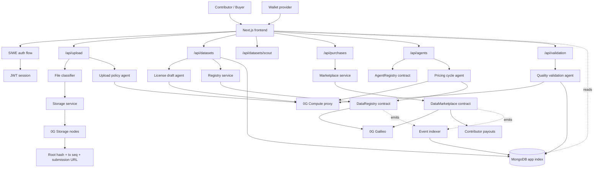
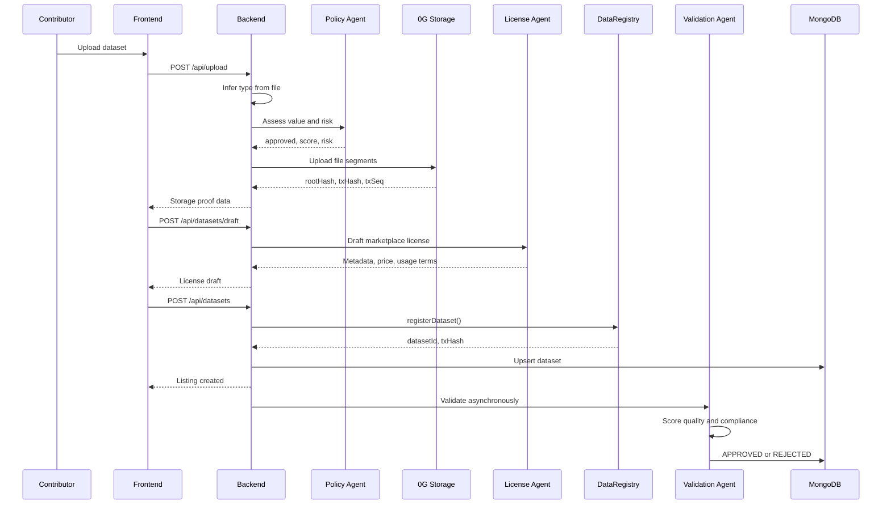
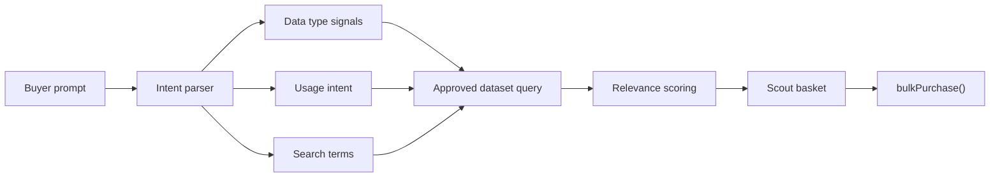
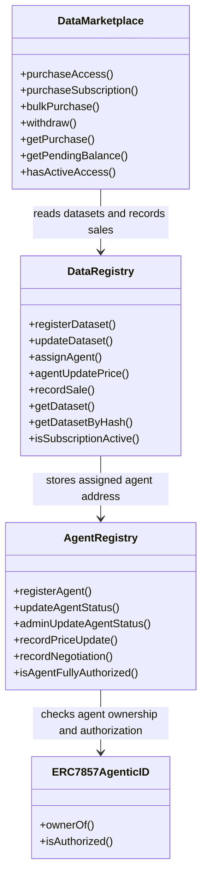

# Zhunix

Zhunix turns raw datasets into programmable, agent-managed data licenses on 0G. A contributor uploads data once; Zhunix classifies it, checks policy risk, stores it on 0G Storage, drafts a marketplace license, registers the dataset on-chain, validates quality through 0G Compute, and exposes approved assets to buyers through a searchable marketplace and AI scout.

The product is the lifecycle, not a static listing page. Zhunix demonstrates an end-to-end data economy where every licensed dataset has a storage root, an on-chain registry record, an assigned agent, validation status, pricing logic, purchase history, and buyer access policy.

Zhunix does not pretend that every uploaded file is useful. It rejects low-value or risky uploads, keeps unvalidated data out of marketplace discovery, and only promotes datasets that pass the validation agent's quality gate.

---

## Live Deployment

| Artifact | Value |
|----------|-------|
| Chain | 0G Galileo Testnet (chainId 16602) |
| Frontend | `frontend/` — Next.js app |
| Backend | `backend/` — Express API |
| DataRegistry | `0xE71EEE7D42d6DE3Ed1B3B5b2685c78b452965757` |
| DataMarketplace | `0xc214A73fAAd4Fa6a367582C3C9aFeFF806486Ba3` |
| AgentRegistry | `0xd0d990f448c3155c961b30AD3Ae215C6A14d3281` |
| Example upload tx | `0x...` |
| Example purchase tx | `0x...` |
| Example storage root | `0x...` |

Every dataset is anchored by a 0G Storage root hash and registered on-chain through DataRegistry. Every purchase is settled through DataMarketplace and exposed as a licensed access record.

## 0G Integration

| Component | Usage |
|-----------|-------|
| 0G Chain | Licenses, purchases, subscriptions, agent pricing, and payouts via Solidity contracts on 0G Galileo |
| 0G Storage | Datasets stored via the 0G Storage SDK, identified by root hash and storage scan URL |
| 0G Compute | Agents use 0G Compute for license drafting, validation, and pricing — see `backend/src/services/` |
| Agent Identity | AgentRegistry links contributor wallets to agentic IDs for validation workflows |

---

## Architecture

Zhunix is split into three major surfaces:

- **Frontend**: user-facing app for upload, marketplace discovery, wallet auth, purchases, licensed access, and dashboards.
- **Backend**: API and agent orchestration layer for classification, storage, license drafting, validation, indexing, and purchase/access reads.
- **Smart contracts**: on-chain registry, marketplace settlement, and agent registration contracts.



### Layer Responsibilities

**Perception and policy** - The upload controller receives a file, infers its data type from MIME, extension, headers, and text samples, then calls the upload policy service. The policy agent scores value and compliance risk before the file is allowed to move into storage.

**Storage** - The storage service writes the file to a temporary local path, builds a Merkle tree with the 0G SDK, uploads segments to 0G Storage, and returns the root hash, transaction hash, transaction sequence, and storage scan URL. The root hash becomes the dataset's canonical storage identity.

**License drafting** - The license draft service uses 0G Compute to generate a marketplace title, description, usage permission, price, subscription price, tags, and buyer-safe preview. If the compute call fails, a deterministic fallback draft is generated locally so the user can continue.

**On-chain registration** - `DataRegistry` stores contributor, agent, storage root hash, metadata URI, data type, usage permission, dataset status, access price, subscription price, sales totals, and whether agent pricing is enabled.

**Validation** - The validation agent scores datasets across completeness, accuracy, authenticity, consistency, buyer value, and compliance risk. Datasets below the approval threshold or marked high risk remain rejected and are excluded from buyer-facing discovery.

**Marketplace discovery** - Buyers browse approved datasets directly or ask Marketplace Scout for data in natural language. Scout interprets data type, usage intent, budget, and relevance, then returns a ranked basket of approved datasets.

**Purchasing and access** - Buyers purchase access, subscriptions, or baskets on-chain through `DataMarketplace`. The backend indexes purchase events and exposes licensed access records, simulated use actions, analytics queries, and sharing checks.

**Agent pricing** - Approved datasets with agent pricing enabled can run a pricing cycle. The compute service recommends a new price from sales, revenue, data type, current price, and demand level, then updates the registry through the assigned agent flow.

---

## Dataset-To-License Proof Chain

Zhunix is built around a reconstructable chain from file upload to licensed marketplace asset:

1. The contributor signs into the app with a wallet.
2. The file is classified and policy-checked.
3. 0G Storage returns a root hash.
4. The license draft agent creates metadata tied to that root hash.
5. `DataRegistry.registerDataset` writes the license record on-chain.
6. The backend stores the on-chain id and indexed metadata in MongoDB.
7. The validation agent writes the quality result.
8. Only approved records appear in marketplace discovery.
9. Buyer purchases are settled by `DataMarketplace`.
10. Purchase events are indexed and converted into licensed access records.



---

## Marketplace Scout

Marketplace Scout is the buyer-side agent. Instead of making buyers manually filter dozens of datasets, Scout accepts a natural-language request, interprets intent, searches approved datasets, scores relevance, and returns a basket.

Example:

```text
Find behavioral customer datasets for analytics with a budget under 1.5 0G.
```

Scout returns:

- Matched data types
- Matched usage permissions
- Search terms extracted from the prompt
- Approved datasets only
- Quality score
- Relevance score
- Match reasons
- Estimated total
- Bulk purchase basket



This is where Zhunix starts to feel like a real data procurement product rather than a file browser. A buyer can say what they need, and the agent only returns data that has already passed marketplace quality gates.

---

## Smart Contracts

Zhunix uses three Solidity contracts.



### DataRegistry

`DataRegistry` is the source of truth for licensed datasets. It records:

- Dataset id
- Contributor address
- Agent address
- 0G Storage root hash
- Metadata URI
- Data type
- Usage permission
- Dataset status
- Pay-per-access price
- Subscription price
- Sales totals
- Revenue totals
- Registration and update timestamps
- Agent pricing flag

Important events:

- `DatasetRegistered`
- `DatasetUpdated`
- `AgentAssigned`
- `AgentPriceUpdated`
- `SaleRecorded`
- `SubscriptionRecorded`

### DataMarketplace

`DataMarketplace` handles economic settlement.

It supports:

- One-time access purchases
- 30-day subscriptions
- Bulk purchases
- Platform fee routing
- Contributor withdrawal accounting
- Buyer purchase history
- Active access checks

Important events:

- `PurchaseCreated`
- `PurchaseSettled`
- `Withdrawn`
- `PlatformFeeUpdated`
- `PlatformWalletUpdated`

### AgentRegistry

`AgentRegistry` maps autonomous agents to contributors and ERC-7857-style Agentic IDs. It verifies that a contributor owns the agentic token and that the agent wallet is authorized.

It tracks:

- Agent address
- Contributor address
- Agentic token id
- Metadata URI
- Agent status
- Price update count
- Negotiation count

Important events:

- `AgentRegistered`
- `AgentStatusUpdated`
- `AgentActivityRecorded`
- `AgenticIdContractUpdated`

---

## Readable Licensed Access

After a buyer purchases a dataset, Zhunix can return a license certificate-style response instead of just a boolean.

The licensed access object includes:

- Dataset id
- Buyer wallet
- Contributor wallet
- License holder
- Non-transferable status
- Certificate id
- Access token
- Access mode
- Usage permission
- Storage root hash
- Storage submission URL
- Metadata URI
- Purchase transaction hash
- Purchase type
- Subscription expiry
- Policy list
- Usage log

The buyer can then simulate:

- AI training job
- Analytics query
- Derived insight generation
- Share attempt check

This makes the post-purchase experience judgeable. The demo can show what a buyer is allowed to do, not only that a payment happened.

---

## Public Marketplace Quality Gate

The marketplace does not surface every uploaded dataset. Zhunix filters for:

- `status = ACTIVE`
- `validationStatus = APPROVED`
- `qualityScore >= 65`

The buyer UI and Marketplace Scout both respect this threshold. Low-quality, risky, incomplete, or rejected uploads stay out of the procurement path.

---

## Operational Controls

The backend exposes several tunables through environment variables.

### Storage Upload Controls

| Variable | Default | Effect |
|---|---:|---|
| `OG_STORAGE_UPLOAD_TASK_SIZE` | `8` | Number of file segments per upload task |
| `OG_STORAGE_UPLOAD_TIMEOUT_MS` | `180000` | Maximum backend upload time before returning a controlled error |
| `OG_STORAGE_UPLOAD_NODE_ATTEMPTS` | `3` | Number of random 0G storage node selection attempts |

These exist because storage-node availability can vary during live demos. Zhunix avoids hanging forever in the upload phase and can retry different eligible storage nodes.

### Agent Pricing Cycle

The backend runs agent pricing cycles automatically every 30 minutes:

```text
agentService.runAllAgentCycles()
```

Only datasets that are approved, assigned to an agent, and have `agentPricingEnabled = true` are eligible.

Manual trigger:

```http
POST /api/agents/:datasetId/price-cycle
Authorization: Bearer <token>
```

### Validation

Validation runs automatically after dataset registration, but can also be triggered manually:

```http
POST /api/validation/:datasetId/validate
Authorization: Bearer <token>
```

---

## How It Lands Against Hackathon Judging

### 0G Storage

Zhunix uses 0G Storage as the dataset identity layer. A file upload produces a root hash that is carried into the license metadata and on-chain registry record.

### 0G Compute

Zhunix uses 0G Compute for:

- Upload policy assessment
- License metadata drafting
- Dataset quality validation
- Dynamic pricing recommendations

### On-Chain Data Economy

The dataset lifecycle is not trapped in the app database. Core marketplace actions are represented through Solidity contracts:

- Dataset registration
- Agent assignment
- Agent price updates
- Purchases
- Subscriptions
- Bulk purchases
- Contributor payouts

### Agentic UX

Agents do useful product work:

- They evaluate whether a file is worth licensing.
- They draft marketplace terms.
- They validate quality.
- They recommend prices.
- They scout datasets for buyers.

### Buyer-Safe Marketplace

The marketplace is quality-gated. Scout only recommends approved datasets above the threshold, which makes the buyer experience more trustworthy than a raw upload directory.

---

## Quick Start

### Prerequisites

- Node.js 18+
- npm
- MongoDB
- 0G Galileo RPC
- 0G Storage indexer URL
- 0G Compute service URL and API secret
- Wallet private key for platform-side storage/contract actions

### Install

```bash
git clone <repo-url>
cd zhunix

cd backend
npm install

cd ../frontend
npm install

cd ../smart-contract
npm install
```

## Environment Variables

See `.env.example` for the full annotated list. Split between the two services:

### Backend (`backend/.env`)

| Group | Vars |
|-------|------|
| Server | `PORT`, `NODE_ENV` |
| Database | `MONGODB_URI` |
| Auth | `JWT_SECRET`, `JWT_EXPIRES_IN` |
| 0G Network | `OG_RPC_URL`, `OG_CHAIN_ID`, `OG_STORAGE_NODE_URL`, `OG_STORAGE_UPLOAD_TASK_SIZE`, `OG_STORAGE_UPLOAD_TIMEOUT_MS`, `OG_STORAGE_UPLOAD_NODE_ATTEMPTS` |
| 0G Compute | `ZG_SERVICE_URL`, `ZG_API_SECRET`, `ZG_MODEL` |
| Contracts | `DATA_REGISTRY_ADDRESS`, `DATA_MARKETPLACE_ADDRESS`, `AGENT_REGISTRY_ADDRESS` |
| Platform | `PLATFORM_PRIVATE_KEY` |

### Frontend (`frontend/.env.local`)

| Group | Vars |
|-------|------|
| API | `NEXT_PUBLIC_API_URL` |
| 0G Network | `NEXT_PUBLIC_OG_CHAIN_ID`, `NEXT_PUBLIC_OG_RPC_URL` |
| Contracts | `NEXT_PUBLIC_DATA_MARKETPLACE_ADDRESS` |
| Default Agent | `NEXT_PUBLIC_DEFAULT_AGENT_NAME`, `NEXT_PUBLIC_DEFAULT_AGENT_ADDRESS`, `NEXT_PUBLIC_DEFAULT_AGENT_TOKEN_ID` |

> Your local `.env` files can hold the union of both — backend and frontend will each read what they need. Never commit `.env` or `.env.local`.

### Run Locally

Backend:

```bash
cd backend
npm run dev
```

Frontend:

```bash
cd frontend
npm run dev
```

Build checks:

```bash
cd backend
npm run build

cd ../frontend
npm run build
```

---

## Demo Walkthrough

> A guided flow for evaluators and first-time users.

### 1. Landing & Thesis
Open the root URL. The landing page communicates the core premise:
data should be **licensed, validated, and monetized** — not scraped.

### 2. Authentication
Connect your wallet and sign in via **SIWE (Sign-In with Ethereum)** to establish an on-chain identity.

### 3. Upload a Dataset
Navigate to `/upload` and submit any CSV file to trigger the agentic pipeline:

| Step | Action |
|------|--------|
| Classify | AI categorizes the dataset by type and sensitivity |
| Assign Agent | Routes to the appropriate processing agent |
| Store | Uploads to decentralized storage |
| Draft License | Generates a usage license with AI-suggested terms |
| List On-Chain | Publishes the listing to the smart contract |
| Validate | Runs quality scoring and returns a validation report |

### 4. Inspect the Generated License
The license output includes:
- **Name** and dataset identity
- **Usage rights** (commercial, research, derivative, etc.)
- **Price** (in tokens)
- **Privacy mode** (public / restricted)
- **Storage root hash** or submission URL for provenance

### 5. Dataset Detail Page
Open the dataset's page to review its **quality score** and full validation breakdown.

### 6. Marketplace
Go to `/marketplace` and:
1. Apply filters to surface only **approved datasets**
2. Open **Marketplace Scout** and describe a buyer's data need in natural language
3. Review the **ranked basket** with AI-generated match reasons
4. Complete a **single purchase** or use the **bulk purchase** path
5. Open the licensed access flow to view the **certificate / policy response**

---

### One-Line Judge Takeaway

> *Zhunix is a complete agentic data licensing loop: upload, store, license, validate, list, buy, and enforce usage policy.*

---

## API Surface

| Route | Method | Auth | Purpose |
|---|---|---|---|
| `/health` | GET | Public | API health check |
| `/api/auth/nonce/:address` | GET | Public | SIWE nonce |
| `/api/auth/verify` | POST | Public | SIWE verification and JWT issuance |
| `/api/upload` | POST | JWT | Classify, policy-check, and upload file to 0G Storage |
| `/api/datasets` | GET | Public | List datasets |
| `/api/datasets/:id` | GET | Public | Get one dataset by on-chain id |
| `/api/datasets/draft` | POST | JWT | Generate license draft |
| `/api/datasets/scout` | POST | Public | Run Marketplace Scout |
| `/api/datasets` | POST | JWT | Register dataset on-chain |
| `/api/datasets/:id` | PUT | JWT | Update contributor-controlled price/status |
| `/api/validation/:datasetId` | GET | Public | Read validation result |
| `/api/validation/pending/list` | GET | Public | List pending validations |
| `/api/validation/:datasetId/validate` | POST | JWT | Trigger manual validation |
| `/api/agents` | POST | JWT | Register agent |
| `/api/agents/:address` | GET | Public | Get agent by address |
| `/api/agents/:datasetId/price-cycle` | POST | JWT | Trigger pricing agent |
| `/api/purchases` | GET | JWT | User purchase history |
| `/api/purchases/:id` | GET | JWT | One purchase |
| `/api/purchases/balance` | GET | JWT | Contributor pending balance |
| `/api/purchases/access/:datasetId` | GET | JWT | Access check |
| `/api/purchases/licensed/:datasetId` | GET | JWT | Licensed access certificate |
| `/api/purchases/licensed/:datasetId/use` | POST | JWT | Simulate licensed use |
| `/api/purchases/licensed/:datasetId/query` | POST | JWT | Simulate licensed query |
| `/api/purchases/licensed/:datasetId/share-check` | POST | JWT | Check sharing policy |

---

## Project Structure

```text
zhunix/
|-- backend/
|   |-- src/
|   |   |-- config/             # environment config
|   |   |-- controllers/        # route handlers
|   |   |-- middleware/         # auth, validation, errors
|   |   |-- models/             # MongoDB models
|   |   |-- routes/             # Express routes
|   |   |-- services/
|   |   |   |-- agent/          # pricing cycles
|   |   |   |-- compute/        # 0G Compute pricing calls
|   |   |   |-- contracts/      # ethers contract services
|   |   |   |-- indexer/        # on-chain event indexer
|   |   |   |-- license/        # license draft agent
|   |   |   |-- storage/        # 0G Storage integration
|   |   |   `-- validation/     # policy + quality agents
|   |   |-- types/              # shared backend types
|   |   `-- index.ts            # Express app bootstrap
|   `-- package.json
|-- frontend/
|   |-- app/
|   |   |-- agents/             # agent directory
|   |   |-- dashboard/          # contributor dashboard
|   |   |-- dataset/[id]/       # dataset detail
|   |   |-- marketplace/        # buyer marketplace + scout
|   |   |-- upload/             # automated license pipeline
|   |   `-- page.tsx            # landing page
|   |-- components/ui/          # shared UI kit
|   |-- lib/                    # API client, wallet auth, contract helpers
|   `-- package.json
`-- smart-contract/
    |-- contracts/
    |   |-- AgentRegistry.sol
    |   |-- DataMarketplace.sol
    |   `-- DataRegistry.sol
    |-- ignition/               # Hardhat Ignition deployments
    `-- package.json
```

---

## Tech Stack

- **Next.js 15.3.1** and React 19
- **TypeScript**
- **Express 5**
- **MongoDB + Mongoose**
- **Ethers v6**
- **SIWE**
- **JWT**
- **Zod**
- **0G Storage SDK**
- **0G Compute through OpenAI-compatible client**
- **Solidity**
- **Hardhat + Ignition**
- **Lucide React**

---

## Current Limitations

Zhunix is a hackathon prototype, so the scope is intentionally focused.

- Buyer-side encrypted file delivery is represented by licensed access metadata, but production-grade private data rooms are future work.
- Licensed use actions are policy-aware simulations, not full private compute jobs over raw datasets yet.
- Agent pricing works on approved datasets, but richer market-making and negotiation are future work.
- 0G Storage node health can affect upload completion during live demos, so the backend includes timeouts, retries, and random node selection.

---

## Roadmap

Near-term:

- Encrypted buyer data-room downloads
- Dataset preview generation
- Storage node health scoring
- Contributor revenue analytics
- Production-grade licensed compute jobs

Mid-term:

- Agent-to-agent license negotiation
- Dataset bundles
- Royalty splits
- Dataset versioning
- Proof-of-use receipts
- Contributor and agent reputation

Long-term:

- Cross-marketplace license interoperability
- Privacy-preserving queries
- Autonomous data agents that bundle, price, negotiate, and renew licenses
- Enterprise API for AI teams sourcing compliant training data

---

## Team

Built for the hackathon as an end-to-end 0G data licensing prototype.

## License

Add your preferred license before final submission.
